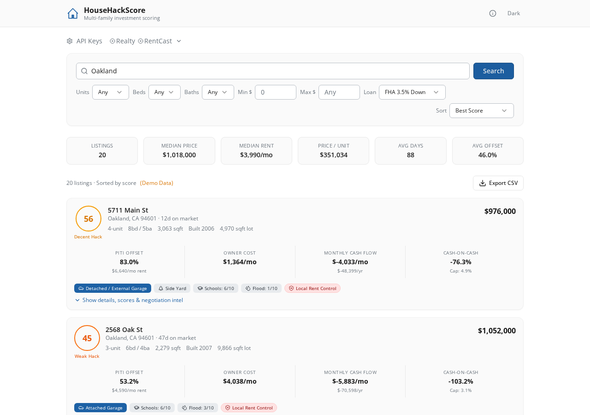
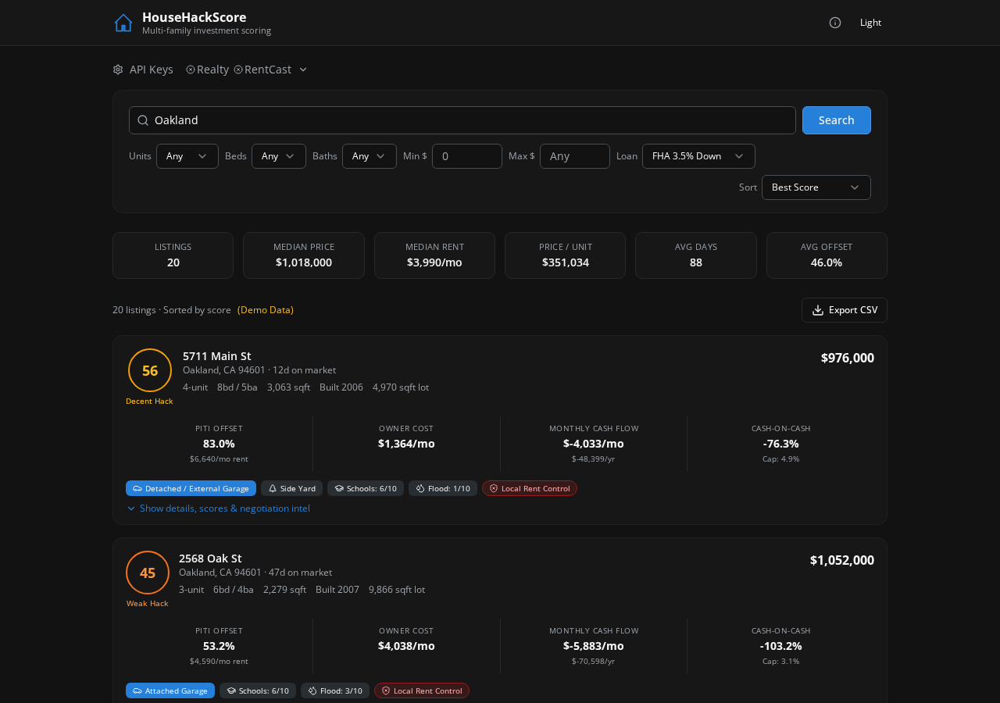

# HouseHackScore — Multi-Family Investment Scoring

A comprehensive house-hacking deal analyzer for duplexes, triplexes, and fourplexes. Scores each property based on how well rental income offsets your mortgage, with VA loan support, cash flow projections, rent control awareness, and negotiation intel.

**Live App:** [househack-scorer.vercel.app](https://househack-scorer.vercel.app)

## Screenshots

### Light Mode


### Dark Mode


## Features

- **Multi-Dimension Scoring** — Every listing scored 0–100 based on PITI offset, cash flow, cap rate, price/unit, building condition, school quality, flood risk, and more
- **VA Loan Support** — 0% down payment option for veterans alongside FHA (3.5%) and conventional (20%) financing
- **Cash Flow Projections** — Monthly and annual cash flow with vacancy rate modeling (default 5%)
- **Rent Control Awareness** — Tooltips flagging local rent control laws (e.g., CA AB 1482 owner-occupied duplex exemption)
- **Negotiation Intel** — Price reduction history with dates, amounts, and negotiation leverage signals
- **PITI Offset Analysis** — See exactly how much of your mortgage is covered by rental income
- **Market Overview** — Median price, median rent, price/unit, and average PITI offset for your market
- **RentCast Integration** — Real rental comps for accurate income projections
- **Export to CSV** — One-click download of all listing data with every metric
- **Google Sheets Export** — Professionally formatted spreadsheet with conditional formatting
- **Dark Mode** — Full light/dark theme support
- **Responsive Design** — Works on desktop, tablet, and mobile

## Score Labels

| Score | Label |
|-------|-------|
| 70+ | Strong Hack |
| 55–69 | Decent Hack |
| 40–54 | Weak Hack |
| < 40 | Avoid |

## One-Click Deploy

### Deploy to Vercel (Recommended)

[](https://vercel.com/new/clone?repository-url=https%3A%2F%2Fgithub.com%2Fbbuxton0823%2Fhousehack-scorer&project-name=househack-scorer&framework=other&buildCommand=npm%20run%20build&outputDirectory=dist%2Fpublic&installCommand=npm%20install)

### Deploy to Railway

[](https://railway.com/template/new?repo=bbuxton0823/househack-scorer)

### Deploy to Render

[](https://render.com/deploy?repo=https://github.com/bbuxton0823/househack-scorer)

## Quick Start

### Prerequisites

- [Node.js](https://nodejs.org/) 18 or higher
- npm (comes with Node.js)

### Install & Run

```bash
# Clone the repo
git clone https://github.com/bbuxton0823/househack-scorer.git
cd househack-scorer

# Install dependencies
npm install

# Start the development server
npm run dev
```

The app will be running at **http://localhost:5000**.

### Production Build

```bash
# Build for production
npm run build

# Run the production server
NODE_ENV=production node dist/index.cjs
```

## API Key Setup (Optional)

By default, HouseHackScore runs with demo data so you can explore immediately.

For real listings and rental comps, add your API keys via the **API Keys** button in the top-left:

1. **Realty in US** (RapidAPI) — Powers the property search. Get a key at [RapidAPI](https://rapidapi.com/apidojo/api/realty-in-us).
2. **RentCast** — Powers rental comp data for accurate income projections. Get a key at [RentCast](https://www.rentcast.io/).

## How It Works

The owner lives in one unit and rents out the others. HouseHackScore calculates:

- **PITI Offset** — What percentage of your total mortgage (principal, interest, taxes, insurance) is covered by rental income from the other units
- **Owner Cost** — Your actual out-of-pocket monthly housing cost after collecting rent
- **Cash Flow** — Net monthly/annual income (or loss) after all expenses
- **Cash-on-Cash Return** — Annual return on your down payment investment
- **Cap Rate** — Property's net operating income as a percentage of purchase price

## Tech Stack

- **Frontend** — React, Tailwind CSS, shadcn/ui
- **Backend** — Express.js
- **Build** — Vite
- **Language** — TypeScript
- **APIs** — Realty in US (RapidAPI), RentCast

## Project Structure

```
househack-scorer/
├── client/src/
│   ├── pages/home.tsx      # Main app — search, results, scoring, cash flow
│   ├── components/ui/      # shadcn/ui components
│   └── lib/                # Query client, utilities
├── server/
│   ├── routes.ts           # API endpoints (search, export, rent comps)
│   └── storage.ts          # Storage interface
├── shared/
│   └── schema.ts           # TypeScript types and Zod schemas
└── screenshots/            # App screenshots
```

## License

MIT
